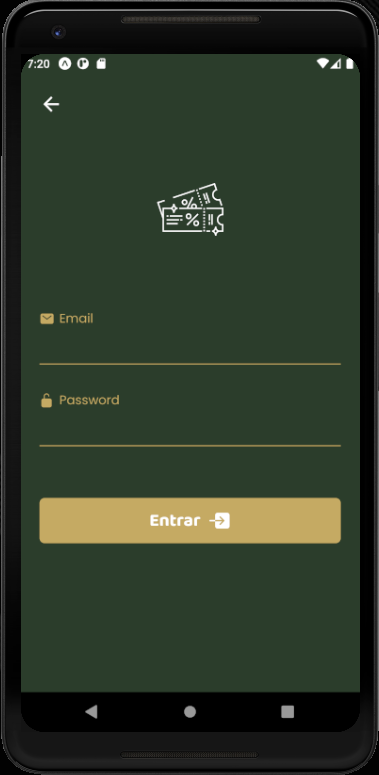
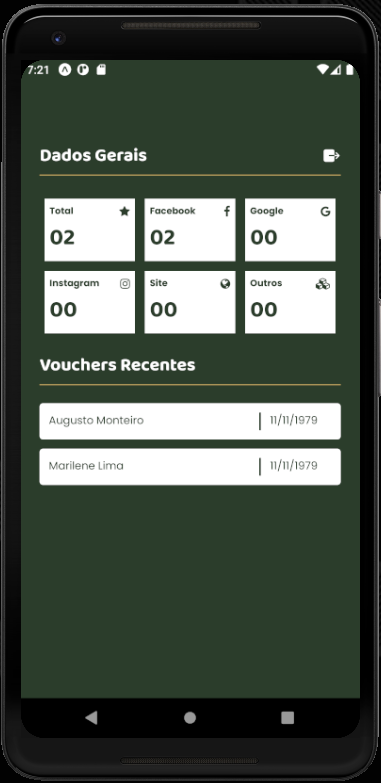

# React Native Birthday

### application in React Native using the API [Laravel Happy Birthday](https://github.com/augustojaml/laravel-api-happy-birthday)

- the main objective was to run the features since this application is web-oriented

# Home page

# Login page

# Login page Errors

# Dashboard

# Form

# Form Errors

# Modal Select

# Congratulations

